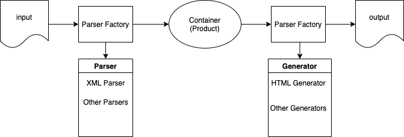

# Converter #
A command-line conversion tool

## Usage
```sh
converter input_filename
```

## Example
```sh
robinhu@bins-mac converter % ./converter cd_catalog.xml
---- Conversion started ----
WARNING: Catalog (BOOK) not supported.
Loaded 25/26 records from XML file (cd_catalog.xml).
HTML file (result.html) generated, 25 records.
---- Conversion completed ----
```

## Build Environment
MacOS Catalina 10.15

build command:
```sh
make
```

## Workflow


## Features
1. Used singleton and factory hybrid pattern. Singleton factory can create multiple parsers, generators, and products. It would be easier if we need to:
   1. Parse data from other resources, like JSON, database, etc.
   2. Generate different results, like JSON, CSV, etc.
   3. Handle other catalogs, like books, movies, etc.
2. Used map feature to simulate reflection when creating objects. Thus, we don't have to modify factory classes when adding a new parser/generator/product. Registration of the new subclass is required.
   1. Parser factory can dynamically create parser objects, based on input type.
   2. Generator factory can dynamically create generator objects, based on ouput type.
   3. Product factory can dynamically create product objects, based on given string. And also, each product can dynamically set or get field values accordingly.
3. Single thread. As we handle only one file, it would be overkill using multithreading. However, it can be easily changed to multithreading if needed.
4. Utilized opensource library tinyxml2 (https://github.com/leethomason/tinyxml2) in XMLParser. Only used it for finding elements in XML.

## File Structure
```sh
.
├── parser
│   └── parser.cpp
│   └── parser.h
│   └── parserfactory.cpp
│   └── parserfactory.h
│   └── xmlparser.cpp
│   └── xmlparser.h
├── generator
│   └── generator.cpp
│   └── generator.h
│   └── generatorfactory.cpp
│   └── generatorfactory.h
│   └── htmlgenerator.cpp
│   └── htmlgenerator.h
├── product
│   └── product.cpp
│   └── product.h
│   └── productfactory.cpp
│   └── productfactory.h
│   └── cd.cpp
│   └── cd.h
├── util
│   └── fileutil.cpp
│   └── fileutil.h
│   └── container.h
├── lib
│   └── tinyxml2.cpp
│   └── tinyxml2.h
├── test
│   └── test.cpp
│   └── test.h
├── global.h
├── main.cpp
├── Makefile
└── README.md
```
| Directory / File       | Description                                                                    |
|------------------------|--------------------------------------------------------------------------------|
| parser/                | classes related to input analysis, like XML parser, JSON parser(not supported yet), etc.          |
| generator/             | classes related to output generation, like HTML generator, JSON generator(not supported yet), etc |
| product/               | classes related to product, like CD, book(not supported yet), etc.                                |
| util/                  | utilities                                                                      |
| lib/                   | tinyxml library, ref https://github.com/leethomason/tinyxml2                   |
| test/                  | test functions                                                                 |
| global.h               | global header                                                                  |
| main.cpp               | main                                                                           |
| Makefile               |                                                                                |


## Author
**Robin Hu**

